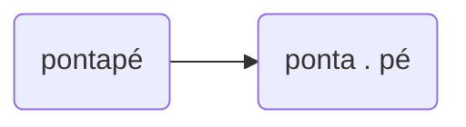

# Consciência silábica

### 1. Descobre as duas palavras que formam as seguintes e escreve-as separadamente. Segue o exemplo.




- salmão 
- soldado 
- carapau 
- queimadura 
- antigamente


###  2. Descobre e copia palavras em que a última sílaba se repete.
```scramble
tabuada, câmara, cuida, grávida, glória,
banda, obrigada, festa, medalha, medida
```