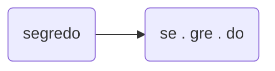

# Consciência silábica
### 1. Escreve a primeira sílaba em falta em cada palavra e descobre nomes de animais.
`_____`quilo 
`_____`rila 
`_____`guim 
`_____`gonha
`_____`ruja
`_____`to
`_____`ranha 
`_____`miga

### 2. Faz a divisão silábica das palavras seguintes. Segue o exemplo.

- __quadrado__
- __desmanchar__
- __comprador__
- __hospital__
- __avariados__