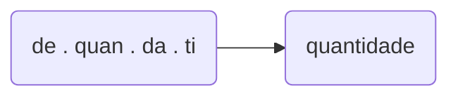

# Consciência silábica
### 1. Ordena as sílabas e escreve as palavras. Segue o exemplo.

#### tró . le . o . pe > `_________`
#### pli . ti . mul . car > `_________`
#### gar . jo > `_________`
#### men . to . tru . ins > `_________`

### 2. Descobre e rodeia, em cada linha, a palavra que não rima com todas as outras.

|||||
|:-:|:-:|:-:|:-:|
|ratoeira|açucareiro|afiadeira |algibeira |
|pico    | chuvisco | marisco  | petisco  |
|abraço  | cachaço  |buraco    |amigalhaço|
