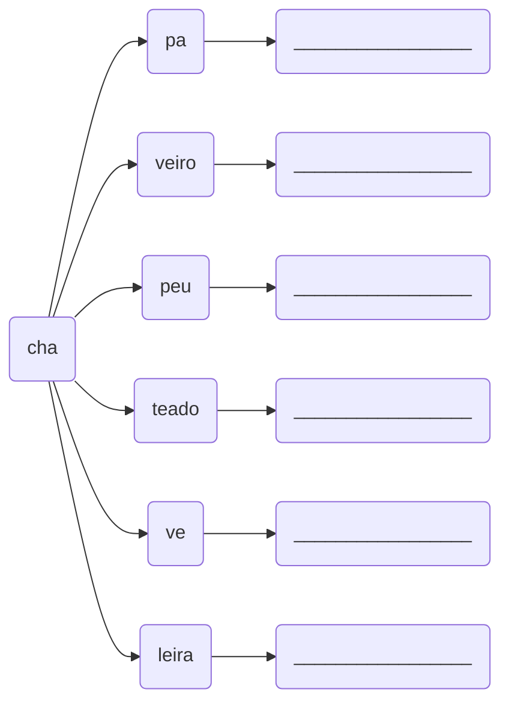

### 1. Junta as sílabas e escreve as palavras.

```mermaid-small
graph LR;
    A(cha)-->B(pa);
    A-->C(veiro)
    A-->D(peu);
    A-->E(teado);
    A-->F(ve);
    A-->G(leira);
    B-->Z(_________________);
    C-->X(_________________);
    D-->Y(_________________);
    E-->T(_________________);
    F-->U(_________________);
    G-->V(_________________);
```

### 2.Escolhe uma das palavras que descobriste e escreve uma frase com ela.